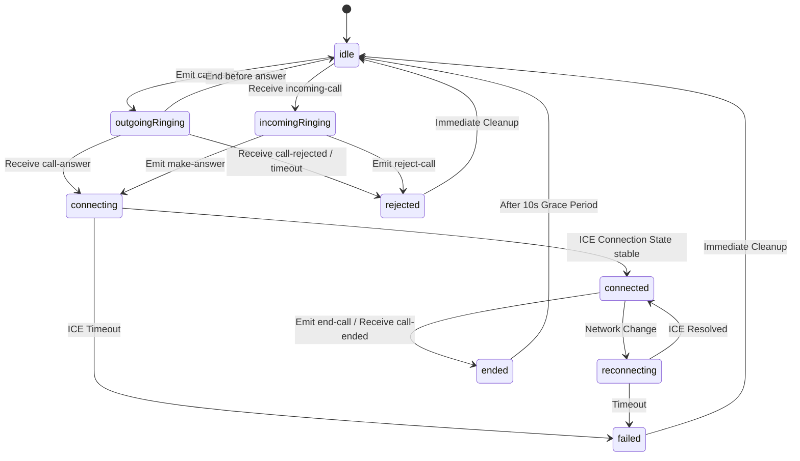

# PHASE 46 — CALL STATE MACHINE

This state machine defines the lifecycle of a WebRTC call within the Flutter client and its impact on the ZRCS Ad Runtime Gate.

## 1. State Definitions

| State | Description | Camera/Mic | Ad Gate Status |
|:---|:---|:---|:---|
| `idle` | No active call activity. | OFF | **ALLOWED** |
| `outgoingRinging` | Client initiated `call-user`, waiting for peer response. | OFF/WARMING | **BLOCKED** |
| `incomingRinging` | Received `incoming-call` event. | OFF | **BLOCKED** |
| `connecting` | Peer accepted (SDP exchange in progress). | ON (Warm) | **BLOCKED** |
| `connected` | RTCPeerConnection is stable/connected. | ON | **BLOCKED** |
| `reconnecting` | Network switch or ICE restart. | ON | **BLOCKED** |
| `ended` | User ended call or received `call-ended`. | OFF | **BLOCKED (10s Grace)** |
| `failed` | Socket disconnect or ICE failure. | OFF | **BLOCKED (Cleanup)** |
| `rejected` | Received `call-rejected` or `call-timeout`. | OFF | **BLOCKED (Cleanup)** |

## 2. Allowed Transitions

## 3. Impact on ZRCS Ad Runtime
- **Hard Block**: Any state other than `idle` must return `canShowAds = false`.
- **Cleanup Requirement**: Transition to `ended`, `rejected`, or `failed` must explicitly call `runtimeStateBinder.setCallEnded()` to trigger the grace period or immediate cleanup.
- **Camera/Mic Safety**: Transition to `idle` must force `isCameraActive = false` and `isMicActive = false` to prevent zombie permission flags from blocking ads indefinitely.
