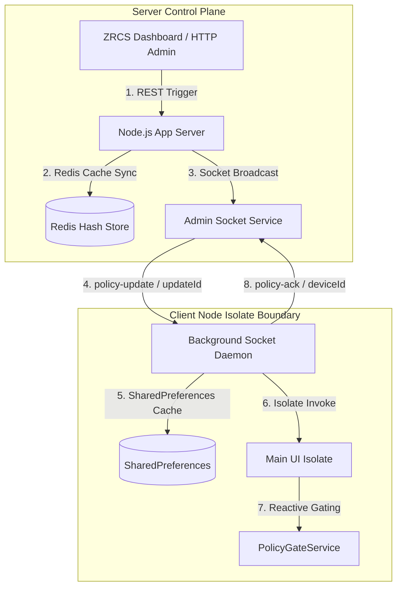

# ZRCS Sovereign Governance: Command-ACK Protocol & Geospatial Privacy

This specification governs the Command-ACK protocol and geospatial fuzzer architecture for the ZYMI sovereign communication platform, securing real-time administrative command propagation and preventing device-level tracking.

---

## 1. Protocol Architecture & Topology

The ZYMI Sovereign Governance framework uses a **Dual-Isolate topology** to guarantee that administrative policy restrictions are propagated atomically to all node daemons.



---

## 2. Command-ACK Socket Protocol

Every administrative policy or nearby setting update must propagate to end-user devices with high consistency. The command pipeline ensures accountability via deterministic acknowledgement logging.

### 2.1 Broadcast Phase
When an administrator modifies a feature gate or nearby global configuration, the server generates a unique `updateId` using a cryptographically secure random number generator (UUID v4) and emits the update payload.

#### Socket Event: `policy-update`
```json
{
  "featureKey": "video_call_enabled",
  "enabled": false,
  "updateId": "8f8b898a-720a-48a0-97cc-0105ad36fb5c"
}
```

#### Socket Event: `nearby-settings-update`
```json
{
  "radius": 5000,
  "fuzzing": true,
  "privacy_mode": "NORMAL",
  "updateId": "4bf8b122-fce2-4752-b13c-74a896be0f6a"
}
```

### 2.2 Reconnection & Synchronization Phase
To prevent stale states (e.g. if the mobile client daemon is temporarily disconnected when a command was broadcast), the client MUST issue a policy fetch request immediately upon connection/reconnection:

#### Socket Event: `policy-fetch`
* **Trigger**: Emitted from background client daemon to server on `connect` / `reconnect`.
* **Server Action**: Queries Redis (`zymi:features` and `zymi:config:nearby`) and emits `policy-sync` back to the requesting socket.

#### Socket Event: `policy-sync`
```json
{
  "features": {
    "video_call_enabled": "true",
    "audio_call_enabled": "true",
    "nearby_enabled": "false"
  },
  "nearbyConfig": {
    "radius": "5000",
    "fuzzing": "0.005",
    "privacy_mode": "NORMAL"
  }
}
```

### 2.3 Acknowledgement (ACK) Phase
Upon applying the configuration payload (writing keys to local `SharedPreferences` and notifying UI listeners), the background isolate must send a confirmation to the server within `500ms`.

#### Socket Event: `policy-ack`
```json
{
  "updateId": "8f8b898a-720a-48a0-97cc-0105ad36fb5c",
  "deviceId": "dev_872198_124987_98231",
  "status": "APPLIED"
}
```

---

## 3. Telemetry & Auditing

The server must capture client acknowledgements and store them immediately in the persistent database to provide real-time telemetry to the ZRCS admin dashboard.

### 3.1 Database Schema
```sql
CREATE TABLE IF NOT EXISTS audit_logs (
    id SERIAL PRIMARY KEY,
    log_type TEXT NOT NULL,          -- Value: 'POLICY_ACK' or 'UPDATE_NEARBY_SETTINGS'
    data TEXT NOT NULL,              -- JSON serialized payload (updateId, deviceId, etc.)
    created_at TIMESTAMP DEFAULT CURRENT_TIMESTAMP
);
```

---

## 4. Geospatial Privacy & Fuzzing Mechanics

To comply with high-level security regulations, the nearby discovery system employs two vital location-masking features:

### 4.1 Strict Privacy Mode Fallback
If the fuzzer configuration returns `privacy_mode === 'STRICT'` or if fuzzer settings are absent/disabled, the server drops nearby records entirely to prevent leakage.
```javascript
if (privacyMode === 'STRICT') {
  return res.json([]);
}
```

### 4.2 Seeded Deterministic Jitter
To prevent an adversary from performing triangulation (submitting repeated queries to calculate the average center point of random coordinate shifts), coordinates are shifted using a **seeded pseudo-random generator** bound to the target user's `id`.

```javascript
const seedOffset = (userId, factor) => {
  const valX = Math.sin(userId * 12345.6789) * 10000;
  const valY = Math.cos(userId * 98765.4321) * 10000;
  const dx = (valX - Math.floor(valX) - 0.5) * factor;
  const dy = (valY - Math.floor(valY) - 0.5) * factor;
  return { dx, dy };
};
```
* **Radius Limit**: The maximum offset is strictly bounded by the `fuzzingFactor` configured by the admin (e.g. `0.005` degrees, which translates to a bounded radius of ~500m).
* **Drift Protection**: Since the coordinates shift is deterministic per target user `id`, the user location appears static on the map, removing any triangulation drift.
