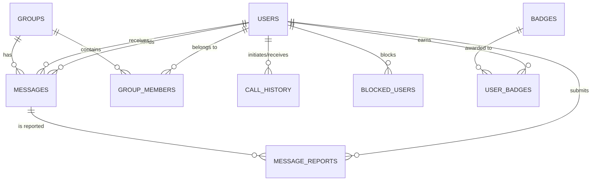

# ZYMI PostgreSQL Database Schema Plan

> **Goal:** Establish a robust, scalable, and normalized relational database architecture for the ZYMI ecosystem.
> **Extensions Required:** `uuid-ossp` (for generating UUIDs) and `postgis` (for geospatial indexing and "Nearby" features).

---

## 1. Entity-Relationship (ER) Overview



---

## 2. Core Identity & Authentication

### `users`
The central identity table. Includes PostGIS geospatial types for the "Nearby" feature.
*   `id`: `UUID` (Primary Key, Default: uuid_generate_v4())
*   `username`: `VARCHAR(50)` (Unique, Indexed)
*   `email`: `VARCHAR(255)` (Unique, Indexed)
*   `password_hash`: `VARCHAR(255)` (Not null)
*   `phone_normalized`: `VARCHAR(20)` (Unique, Indexed, used for internal lookup)
*   `email_verified`: `BOOLEAN` (Default: false)
*   `role`: `VARCHAR(20)` (Default: 'user', Options: 'user', 'admin')
*   `avatar_url`: `VARCHAR(255)`
*   `status`: `VARCHAR(50)` (e.g., 'Available', 'Busy' - updated via sockets)
*   **`location`**: `geometry(Point, 4326)` (PostGIS spatial column for Nearby features)
*   `last_location_update`: `TIMESTAMP WITH TIME ZONE`
*   `created_at`: `TIMESTAMP WITH TIME ZONE` (Default: NOW())
*   `updated_at`: `TIMESTAMP WITH TIME ZONE`

### `otp_tokens`
Manages 2FA and email verification single-use codes.
*   `id`: `UUID` (Primary Key)
*   `user_id`: `UUID` (Foreign Key -> `users.id`, Indexed)
*   `token_hash`: `VARCHAR(255)` (Encrypted OTP value)
*   `type`: `VARCHAR(50)` (e.g., 'email_verify', 'password_reset')
*   `expires_at`: `TIMESTAMP WITH TIME ZONE` (Indexed for cleanup)
*   `used`: `BOOLEAN` (Default: false)

---

## 3. Real-Time Chat & Groups

### `messages`
Stores both 1-on-1 and Group messages.
*   `id`: `UUID` (Primary Key)
*   `sender_id`: `UUID` (Foreign Key -> `users.id`, Indexed)
*   `recipient_id`: `UUID` (Foreign Key -> `users.id`, Nullable - used for 1-on-1)
*   `group_id`: `UUID` (Foreign Key -> `groups.id`, Nullable - used for group chat)
*   `body`: `TEXT` (Encrypted at application layer if E2EE is enabled)
*   `message_type`: `VARCHAR(20)` (e.g., 'text', 'image', 'video', 'system')
*   `status`: `VARCHAR(20)` (e.g., 'sent', 'delivered', 'seen', 'failed')
*   `attachment_url`: `VARCHAR(255)` (Nullable)
*   `created_at`: `TIMESTAMP WITH TIME ZONE` (Indexed for timeline sorting)

### `groups`
Represents a multi-user chat room.
*   `id`: `UUID` (Primary Key)
*   `name`: `VARCHAR(100)`
*   `description`: `TEXT`
*   `avatar_url`: `VARCHAR(255)`
*   `created_by`: `UUID` (Foreign Key -> `users.id`)
*   `created_at`: `TIMESTAMP WITH TIME ZONE`

### `group_members` (Many-to-Many Relationship)
Junction table linking `users` to `groups`.
*   `group_id`: `UUID` (Foreign Key -> `groups.id`)
*   `user_id`: `UUID` (Foreign Key -> `users.id`)
*   `role`: `VARCHAR(20)` (Default: 'member', Options: 'admin', 'member')
*   `joined_at`: `TIMESTAMP WITH TIME ZONE`
*   **Primary Key**: Composite (`group_id`, `user_id`)

---

## 4. WebRTC Call History

### `call_history`
Persists the outcome of signaling handshakes and media streams.
*   `id`: `UUID` (Primary Key)
*   `caller_id`: `UUID` (Foreign Key -> `users.id`, Indexed)
*   `callee_id`: `UUID` (Foreign Key -> `users.id`, Nullable for group calls)
*   `group_id`: `UUID` (Foreign Key -> `groups.id`, Nullable)
*   `call_type`: `VARCHAR(20)` ('audio', 'video')
*   `status`: `VARCHAR(20)` ('missed', 'completed', 'rejected', 'failed')
*   `duration_seconds`: `INTEGER` (Default: 0)
*   `started_at`: `TIMESTAMP WITH TIME ZONE`
*   `ended_at`: `TIMESTAMP WITH TIME ZONE`

---

## 5. Gamification System

### `user_points`
*   `id`: `UUID` (Primary Key)
*   `user_id`: `UUID` (Foreign Key -> `users.id`)
*   `points`: `INTEGER`
*   `source`: `VARCHAR(100)` (e.g., 'daily_login', 'profile_completion')
*   `created_at`: `TIMESTAMP WITH TIME ZONE`

### `badges`
*   `id`: `UUID` (Primary Key)
*   `name`: `VARCHAR(100)`
*   `description`: `TEXT`
*   `icon_url`: `VARCHAR(255)`
*   `rule_key`: `VARCHAR(50)` (e.g., '100_calls', '1_year_anniversary')

### `user_badges` (Many-to-Many Relationship)
*   `user_id`: `UUID` (Foreign Key -> `users.id`)
*   `badge_id`: `UUID` (Foreign Key -> `badges.id`)
*   `awarded_at`: `TIMESTAMP WITH TIME ZONE`
*   **Primary Key**: Composite (`user_id`, `badge_id`)

---

## 6. Moderation & Security

### `blocked_users`
*   `blocker_id`: `UUID` (Foreign Key -> `users.id`)
*   `blocked_id`: `UUID` (Foreign Key -> `users.id`)
*   `created_at`: `TIMESTAMP WITH TIME ZONE`
*   **Primary Key**: Composite (`blocker_id`, `blocked_id`)

### `message_reports`
*   `id`: `UUID` (Primary Key)
*   `reporter_id`: `UUID` (Foreign Key -> `users.id`)
*   `message_id`: `UUID` (Foreign Key -> `messages.id`)
*   `reason`: `VARCHAR(255)` (e.g., 'spam', 'harassment')
*   `status`: `VARCHAR(20)` (Default: 'pending', Options: 'reviewed', 'action_taken', 'dismissed')
*   `created_at`: `TIMESTAMP WITH TIME ZONE`

### `auth_audit_logs`
*   `id`: `UUID` (Primary Key)
*   `user_id`: `UUID` (Foreign Key -> `users.id`, Nullable for failed logins)
*   `action`: `VARCHAR(50)` (e.g., 'login_success', 'login_failure', 'password_change')
*   `ip_masked`: `VARCHAR(50)` (Privacy-preserving IP log, e.g., '192.168.1.***')
*   `created_at`: `TIMESTAMP WITH TIME ZONE`

---

## 7. ZRCS (ZYMI Remote Ad-Control System)

These tables govern the admin-controlled monetization layers.

*   **`ad_global_settings`**: `id` (PK), `ads_enabled` (BOOLEAN), `active_network`, `test_mode`.
*   **`ad_network_configs`**: `network_key` (PK), `app_id`, `interstitial_id`, `native_id`, `is_active`.
*   **`ad_placements`**: `placement_key` (PK), `enabled` (BOOLEAN), `min_delay_seconds`.

---

## 8. Geospatial Indexing Strategy (Nearby Feature)

To achieve high-performance spatial queries for the "Nearby" feature, we apply a PostGIS GIST index to the `users.location` column:

```sql
-- Enables fast bounding-box and radius proximity searches
CREATE INDEX idx_users_location ON users USING GIST (location);
```

**Query Example for Nearby Discovery:**
```sql
-- Find users within 5 kilometers (5000 meters) of the querying user's coordinates
SELECT id, username, avatar_url, status
FROM users
WHERE ST_DWithin(
  location,
  ST_SetSRID(ST_MakePoint(:longitude, :latitude), 4326)::geography,
  5000
)
AND id != :current_user_id
AND status = 'Available';
```
