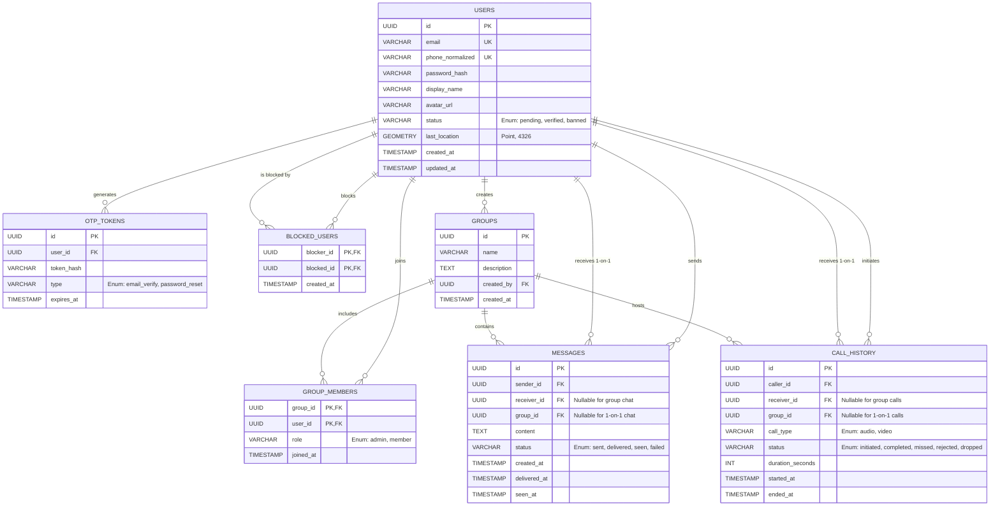

# ZYMI Entity-Relationship Diagram (ERD)

Based on the technical features flow and schema planning, here is the comprehensive Entity-Relationship Diagram for the ZYMI application, organized into three core modules.

